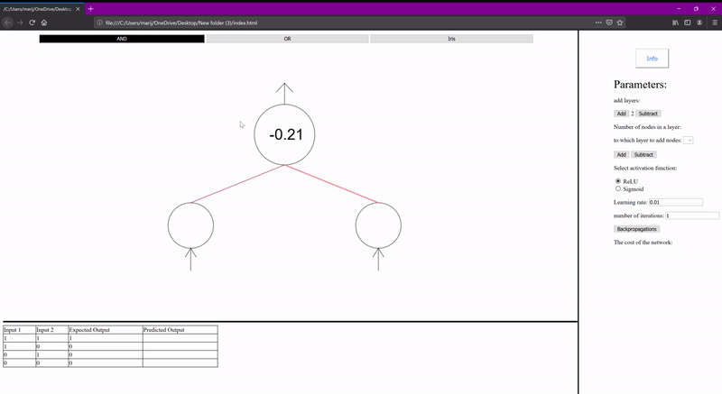

# Interactive-neural-network
This is an interactive neural network where you can change multiple settings and see how it works!

Visit to experiment yourself:
https://neuralnetworkmodel.000webhostapp.com/
About the project itself:
There are 3 loaded datasets: AND, OR and Iris flower datasets, press on there buttons to load the data.

You can train this network with your own data, press on "Your own data" and below network diagram select input and output size.
Then write your own data into the table.

You can add more or less nodes and layers.

You have a whole set of parameters you can tweak to see which one dose what and train your model faster.

The table below shows inputs expected outputs and predicted outputs.

The graph shows how this model preformed over time.

About the code:
Everything is commented so you can go and take a look at it but I will give a quick summary of it.

buttons.js - it holds all of the code for responding to the buttons(I know right!?) and it holds datasets, so when you press
Iris dataset it will change the data on screen and the allays responsible for working with the data.

drawContent.js - it draws all of the graphics(I'm good at creating file names) and it modifies the table that shows how the network
is doing. Also it stores all of the variables.

googleLineChart.js - makes a linear chart that shows networks loss over each iteration.

